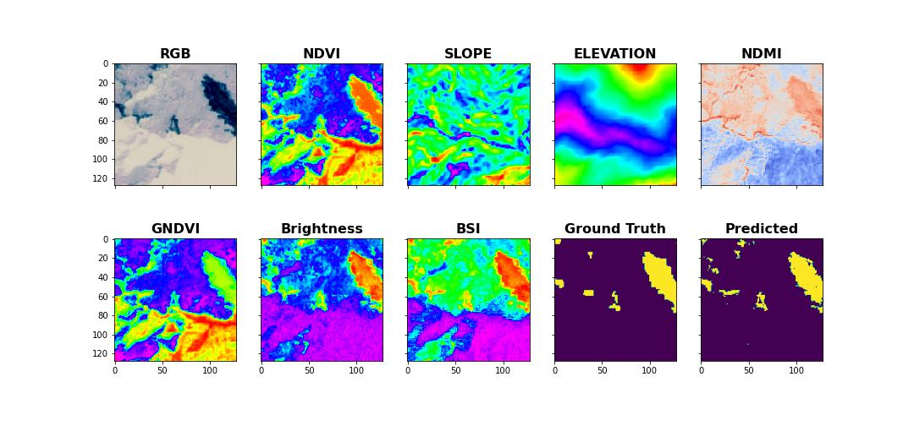
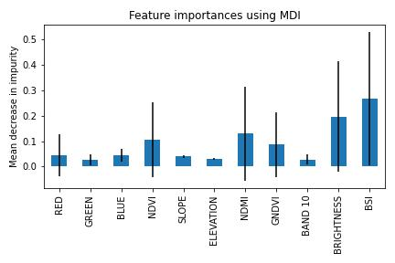

# landslide4sense-rf
Made a try on the Landslide4Sense machine learning challenge using a Random Forest Classifier.

## About Landslide4Sense
The Landslide4Sense challenge was a challenge hosted by [IARAI](https://www.iarai.ac.at/) (Institute of Advanced Research in Artificial Intelligence) 2022. In short they provided 3799 training images labelled with landslide presence/absence. Each image consists of 128x128 pixels with 14 bands, the first 12 bands are from the Sentinel-2 Satellite, the 13th are Slope from ALOS PALSAR and the 14th DEM (Digital Elevation Model) from ALOS PALSAR.

The aim of the challenge was to identify areas where landslides have occurred using machine learning on Satellite imagery which are open and frequently updated. You can read more about it at the [challenge page](https://www.iarai.ac.at/landslide4sense/).

## Read and process the Landslide4Sense training images

The [read_and_process_images.ipynb](read_and_process_images.ipynb) reads the 3799 downloaded Landslide4Sense training images and their corresponding labels, calculates indexes such as NDVI, NDMI... and outputs .npy files. The shell of this script have been borrowed by [iamtekson@GitHub](https://github.com/iamtekson/landslide4sense-solution) and modified to fit my needs.

## Random Forest Classifier

The [RF_classifier.ipynb](RF_classifier.ipynb):
* reads the .npy files, 
* fits the model, 
* evaluate feature importance,
* outputs an example image:
  * ground truth, 
  * predicted output,
  * the most important features

## Example output:

## Feature importance:

  

## Classification report:

 <table border="1" class="dataframe" align="center">
  <thead>
    <tr style="text-align: right;">
      <th></th>
      <th>precision</th>
      <th>recall</th>
      <th>f1-score</th>
      <th>support</th>
    </tr>
  </thead>
  <tbody>
    <tr>
      <th>0.0</th>
      <td>0.99</td>
      <td>0.99</td>
      <td>0.99</td>
      <td>15189027</td>
    </tr>
    <tr>
      <th>1.0</th>
      <td>0.67</td>
      <td>0.67</td>
     <td><b>0.67</b></td>
      <td>375773</td>
    </tr>
    <tr>
      <th>accuracy</th>
      <td></td>
      <td></td>
      <td>0.98</td>
      <td>15564800</td>
    </tr>
    <tr>
      <th>macro avg</th>
      <td>0.83</td>
      <td>0.83</td>
      <td>0.83</td>
      <td>15564800</td>
    </tr>
    <tr>
      <th>weighted avg</th>
      <td>0.98</td>
      <td>0.98</td>
      <td>0.98</td>
      <td>15564800</td>
    </tr>
  </tbody>
</table>
